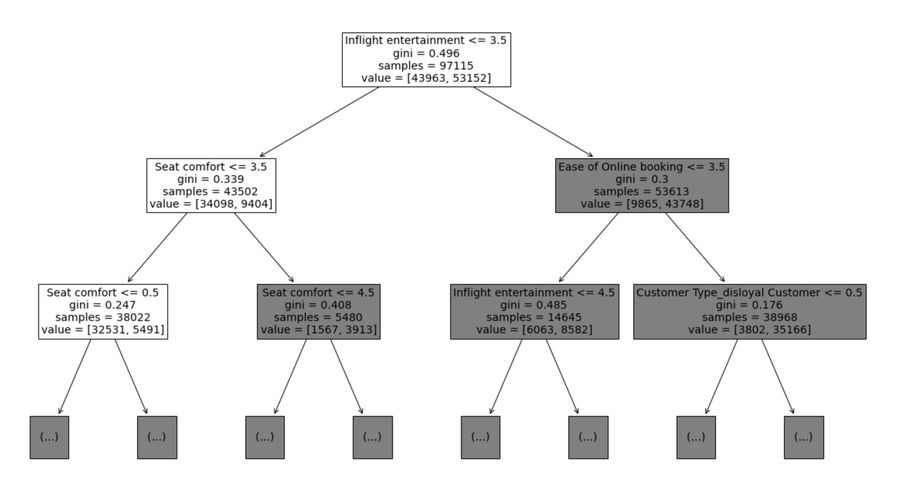
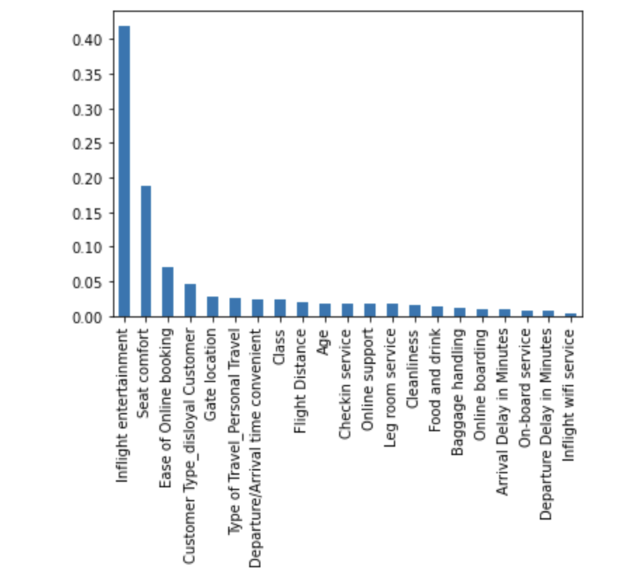

# Decision Tree Analysis on Airline Customer Satisfaction

## Project Overview

In this project, I aim to predict customer satisfaction for an airline using a decision tree model based on survey feedback. This analysis seeks to identify key drivers of satisfaction, helping the airline make data-informed improvements to customer experience. The dataset includes `129,880` responses, covering aspects such as flight class, flight distance, and in-flight entertainment.

This project involves predictive modeling with decision trees, data exploration, and comprehensive evaluation of model performance.

## **Table of Contents**

- [Introduction](#introduction)
- [Step 1: Imports](#step-1-imports)
- [Step 2: Data Exploration, Cleaning, and Preparation](#step-2-data-exploration-cleaning-and-preparation)
- [Step 3: Model Building](#step-3-model-building)
- [Step 4: Results and Evaluation](#step-4-results-and-evaluation)
- [Conclusion](#conclusion)
- [How to Run](#how-to-run)
- [References](#references)
---

## Introduction

The goal of this analysis is to uncover factors that influence customer satisfaction using a decision tree model. By understanding these drivers, the airline can make targeted service improvements, prioritizing factors that strongly impact satisfaction.

---

## Step 1: Imports

### Import Packages

Key packages include:
- `pandas` for data manipulation
- `matplotlib` for visualizations
- `sklearn` for data splitting and model building, including `train_test_split`, `DecisionTreeClassifier`,`GridSearchCV` to fine-tune parameters, and `metrics` for evaluation

### Load the Dataset

The dataset, **Invistico_Airline.csv**, consists of customer feedback on various aspects of their flight experience, including satisfaction ratings.

---

## Step 2: Data Exploration, Cleaning, and Preparation

### Exploring the Data

Key features explored include:
- `Flight Distance`
- `In-flight Entertainment`
- `Class`
- `Satisfaction`

### Checking for Missing Values

Some columns had missing values. As they represented less than `0.5%` of the data, these rows were removed to maintain data quality.

### Encoding Categorical Variables

The `satisfaction` variable was encoded numerically `1 = satisfied`, `0 = unsatisfied` to suit the decision tree model.

### Creating Training and Testing Sets

The data was split into training `75%` and testing `25%` sets for model evaluation.

---

## Step 3: Model Building

### Fitting the Decision Tree Model

Using `DecisionTreeClassifier` from `sklearn`, the model was trained on the training set and generated initial predictions on the test data.

### Hyperparameter Tuning with GridSearchCV

To minimize overfitting, I used grid search to fine-tune parameters like `max_depth` and `min_samples_leaf`, leading to an optimized decision tree model.

---

## Step 4: Results and Evaluation

### Model Performance and Metrics

- **Accuracy:** `94.0%`
  - **Interpretation:** The model correctly predicts customer satisfaction for `94%`of cases. High accuracy suggests the model is well-suited for this data, but should be considered alongside precision, recall, and F1-score to ensure a balanced performance.

- **Precision:** `92.6%`
  - **Interpretation:** Of all the customers predicted to be satisfied, `92.6%` were actually satisfied. This high precision minimizes false positives, meaning fewer instances are wrongly predicted as satisfied, making the model reliable for targeting efforts on genuinely satisfied customers.

- **Recall:** `93.2%`
  - **Interpretation:** Of all the actual satisfied customers, `93.2%` were correctly identified by the model. High recall means the model is effective at identifying satisfied customers and minimizes false negatives, which helps retain customer loyalty by accurately recognizing positive experiences.

- **F1-Score:** `92.9%`
  - **Interpretation:** The F1-score balances precision and recall, indicating the model’s effectiveness in both recognizing actual satisfied customers and minimizing false predictions. A score of `92.9%` suggests the model is robust for operational decisions.

### Confusion Matrix

The confusion matrix provides further insight into model performance:
- **True Positives (TP):** `17,000` Customers correctly predicted as satisfied.
- **True Negatives (TN):** `14,000` Customers correctly predicted as unsatisfied.
- **False Positives (FP):** `1,000` Customers incorrectly predicted as satisfied but were unsatisfied.
- **False Negatives (FN):** `1,100` Customers incorrectly predicted as unsatisfied but were actually satisfied.

### Feature Importance

  **Key features identified:**
1. In-flight Entertainment
2. Seat Comfort
3. Ease of Online Booking





These features had the highest importance scores, indicating a strong influence on customer satisfaction.

---

## Conclusion

**Key Insights**
- **High Model Accuracy:** The decision tree model achieved `94%` accuracy, showing strong predictive power in identifying customer satisfaction.
- **Influential Features:** `In-flight Entertainment`, `Seat Comfort`, and `Ease of Online Booking` are the top drivers of satisfaction based on feature importance analysis.

**Interpretation of Findings**
- **Satisfaction Prediction:** The model’s high accuracy and balanced performance metrics suggest it is effective for operational use in predicting customer satisfaction.
- **In-flight Entertainment’s Impact:** A high score in `In-flight Entertainment` strongly predicts customer satisfaction, emphasizing its importance for customers and validating potential service investments in this area.

**Summary for Stakeholders**
1. **In-flight Entertainment Focus:** Customers with higher satisfaction ratings tended to score in-flight entertainment highly. Prioritizing enhancements in this area could yield a direct increase in customer satisfaction, as the data suggests a strong correlation.
  
2. **Seat Comfort and Online Booking Ease:** These features also significantly impact satisfaction. Ensuring comfortable seating and an easy booking process can enhance customer perception, especially for high-frequency or long-distance travelers who prioritize comfort and convenience.

3. **Strategic Model Use:** With its high accuracy, this model could be incorporated into customer relationship management (CRM) systems to proactively target customers likely to be unsatisfied and gather feedback or offer incentives to improve their experience.

4. **Potential for Further Model Development:** Adding additional features such as `flight duration` and `arrival delay` could provide even greater predictive power, allowing the airline to understand how external factors influence satisfaction.

---


## How to Run

1. **Clone the repository**:

    ```bash
    git clone <https://github.com/MahmoudKhaled98/Decision-Tree-Analysis-on-Airline-Customer-Satisfaction.git>
    ```

2. **Install the required dependencies**:

    ```bash
    pip install -r requirements.txt
    ```

3. **Run the Jupyter notebook**:

    ```bash
    jupyter notebook
    ```
    
## References

- [NumPy Documentation](https://numpy.org/doc/stable/)
- [Pandas Documentation](https://pandas.pydata.org/)
- [Scikit-learn Documentation](https://scikit-learn.org/stable/)
  - [train_test_split](https://scikit-learn.org/stable/modules/generated/sklearn.model_selection.train_test_split.html)
  - [GridSearchCV](https://scikit-learn.org/stable/modules/generated/sklearn.model_selection.GridSearchCV.html)
  - [DecisionTreeClassifier](https://scikit-learn.org/stable/modules/generated/sklearn.tree.DecisionTreeClassifier.html)
  - [plot_tree](https://scikit-learn.org/stable/modules/generated/sklearn.tree.plot_tree.html)
  - [metrics module](https://scikit-learn.org/stable/modules/classes.html#module-sklearn.metrics)
- [Matplotlib Documentation](https://matplotlib.org/stable/contents.html)
- [Seaborn Documentation](https://seaborn.pydata.org/)


